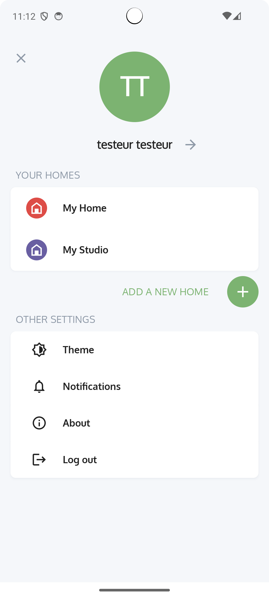
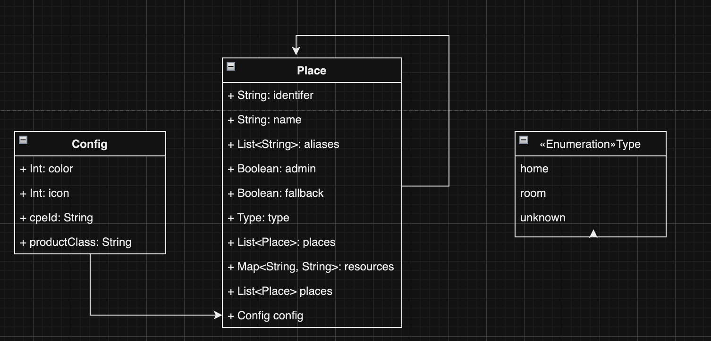

# MDE Places Feature

| Product | Document version | Creation date | Last update |  
|---------|------------------|---------------|-------------|  
| MDE | R0 | 14/11/2023    | 14/11/2023  |  

## Modification

| Date       | Comments | Version | Actor               |  
|------------|----------|---------|---------------------|  
| 14/11/2023 | creation | R0 | Mahmoud ben khedher |  

### Approvals

| Date | Approved by | Version |  
|------|-------------|---------|  
| | | |  

## Goal

The goal of this document is to describe the specifications and requirements of the **Places** feature in **MDE Android application**

### Requirements

The API will be handled via a rest api connection between the cpf microservice and MDE.

### Overview 
Place feature is used to display the list of home of the authenticated user, each place represent a home.<br />  
when creating a new place we are adding a new home gateway.<br />
Below an example of list of homes.



#### Place Data model

```kotlin
data class Place(
    val identifier: String,
    val name: String,
    val aliases: List<String>,
    val admin: Boolean = false,
    val fallback: Boolean = true,
    val type: String = Place.Type.UNKNOWN.value,
    val resources: Map<String, String>,
    val places: List<Place>,
    val config: Config()
) {
    enum class Type(
        val value: String
    ) {
        HOME(value = "home"),
        ROOM(value = "room"),
        UNKNOWN(value = "unknown")
    }
    
    data class Config(
        var color: Int = 0,
        var icon: Int = 0,
        val cpeId: String? = null,
        val productClass: String? = null
    }
}
```
- identifier (String) Unique identifier for the object.
- name (String) name of the place.
- aliases (String[]) array of string that contains aliases of the place
- admin (Boolean)
- fallback (Boolean)
- type (Enum) type of the place (home, room...).
- resources (Object) contains the stringified field 'mde'
- places (Place[]) array of places
- Config is class that contains more details about the home 
    - color: Color of the home, user can select a color from a predefined list of colors.
    - icon: Icon of the home, user can select a Icon from a predefined list of icons
    - cpeId: is the identifier of the gateway it can be mac address if the box is SOP or a formated string if the box is prpl.
    - productClass is the model or class of the box.

Diagram de class



### API responses


*  **200** : OK.


*  **207** : OK.


*  **401** : Unauthorized


*  **403** : Forbidden


*  **400** : Bad request (it can mean that the params/body is wrong or missing a required field)


#### 1) Create a root place

Request:  
- Endpoint: {cpf_base_url}/user/basic<br />  
- Specificator: BODY<br />  
- Body:<br />
```json  
{  
 "connector": "registry"
}
```  
Response:  <br />  
success (httpStatus 200): <br />
NO_CONTENT Root place has been correctly created  
Error (httpStatus 403) <br />
Root place already exists 
```json
{
  "code": -54,
  "data": "Operation forbidden, details: User=f7de7e8b-2bc0-45a3-8592-134da2e90b7d, connector=registry, authType=basic, authExtra=undefined an account with this information already exists",
  "request-id": "d52f75ecaff449dad0e68d94e624679e"
}
```

#### 2) Fetch user places

Request:  
- Endpoint: {cpf_base_url}/places  
- Specificator: GET  
- Body: None

Response:<br />  
Success (HttpStatus 200) <br />  
The key 'resources' is a jsonObject that contains the field 'mde'.<br />  
The key mde is stringified JSON, below is an example of the response.<br />

```json  
{
   "places":[
      {
         "id":"63c13672c9804a5b9a069a2f",
         "name":"rootPlace",
         "aliases":[
            
         ],
         "admin":true,
         "resources":{
            
         },
         "places":[
            {
               "id":"64f898f83a5697024ff998cc",
               "name":"IB4 FUT CDE",
               "aliases":[
                  
               ],
               "type":"home",
               "fallback":true,
               "resources":{
                  "mde":"{\"color\": 0, \"icon\": 0, \"cpeId\": \"<CPE ID, e.g. MAC address or EndpointID>\"}"
               }
            }
         ]
      }
   ],
   "request-id":"fd3ec6693b0d36fea9cafe9f321ccca6"
}
```  

#### 3) Create a new place
To create a new place we need to execute 2 requests.  
1st Request:  
- Endpoint: {cpf_base_url}/places/:root_place_id/place  
- Specificator: POST  
- Params:   
root_place_id:  represent the id of the root place received when user fetch the list of places.   
- Body:
```json  
{
   "name":"Studio",
   "type":"home",
   "fallback":true,
   "resources":{
      "mde":"{\"color\": 0, \"icon\": 0, \"cpeId\": \"<CPE ID, e.g. MAC address or EndpointID>\", \"productClass\": \"class\"}"
   }
} 
```  
- Response <br />  
Success(HttpStatus 200):
```json  
{  
 "id": "65269b25d54f7eaa7160a250",
 "request-id": "2477e34424671b3ea7e2fcdb69e13588"
 }  
```  
Error(HttpStatus 400)
```json
{
  "code": -2,
  "data": "Bad parameter, details: Bad parameter, details: Missing mandatory arguments",
  "request-id": "c273a99696141ea7cb1640bfbadd7f84"
}
```

2nd Request:  
The response of the first request contains the place ID of the newly created place, we will use it to create a home gateway.  
- Endpoint: {cpf_base_url}/devices  
- Specificator: POST  
- Body:
```json  
{
   "devices":[
      {
         "id":"A4:CE:DA:86:4F:F0",
         "placeid":"65269b25d54f7eaa7160a250",
         "authorized":true,
         "type":"hgw"
      }
   ]
}
  
```  
- Response 
Success (httpStatus 207) <br />
```json  
{
   "devices":[
      {
         "status":200,
         "code":0,
         "message":"success, ",
         "resource":{
            "id":"registry_A4:CE:DA:86:4F:F0"
         }
      }
   ],
   "request-id":"4802e208c8e816212501c3ff59619cc0"
}  
```  
Error (httpStatus 207) <br />
```json  
{
   "devices":[
      {
         "code":-301,
         "data":"Internal Server Error, MQTT: No reply, details: details: No reply on sah/to/hgw/A4:CE:DA:86:54:C4/api/Locations/addLocation, callId=1930"
      }
   ],
   "request-id":"a8a99612f116daaf56ade450c5a65ac8"
} 
```  


#### 4) Update an existing place

Request:  
- Endpoint: {cpf_base_url}/places/:place_id  
- Specificator: PATCH  
- Params:   
place_id: identifier of the place  
- Body:
```json  
{
   "name":"Edited home",
   "resources":{
      "mde":"{\"color\": 1, \"icon\": 3, \"cpeId\": \"<CPE ID, e.g. MAC address or EndpointID>\", \"productClass\": \"class\"}"
   }
} 
```  

- Response: <br />    
success (httpStatus 200)
```json  
{ "request-id": "2477e34424671b3ea7e2fcdb69e13588" } 
```  
Error(HttpStatus 400)
```json
{
  "code": -2,
  "data": "Bad parameter, details: Bad parameter, details: Missing mandatory arguments",
  "request-id": "c273a99696141ea7cb1640bfbadd7f84"
}
```

#### 5) Delete place
To remove a place we need to execute 2 requests.      
1st request Delete home gateway :  
- Endpoint: {cpf_base_url}/devices/:hgw_id  
- Specificator: DELETE  
- Params: 
hgw_id: identifier of the gateway  
- Body: None  
- Response <br />  
Success (httpStatus 207)
```json  
{    
    "devices": [    
     {    
        "status": 200,    
        "code": 0,    
        "message": "success, ",    
        "resource": {    
           "id": "registry_A4:CE:DA:86:54:C4"    
        }    
     }    
    ],    
	"request-id": "e6e6b16cb963fd9596eb40af85f5f9e6"
}  
```  

if success  <br />  
2nd request delete place   <br />
- Endpoint: {cpf_base_url}/places/:place_id  
- Specificator: DELETE  
- Params:   
place_id: identifier of the place  
- Body: None  
- Response  <br />  
Success (HttpStatus 200)
```json  
{ "request-id": "aede04ad11556bc27a4121852e6249aa" }  
```  

else cancel
